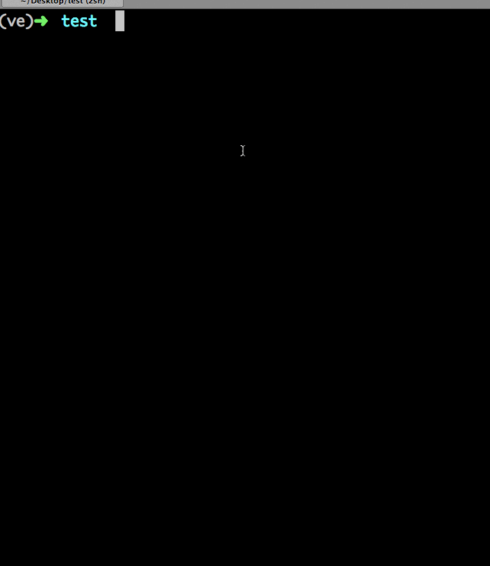

unicore.distribute
==================

Distribution tools for Universal Core content.

.. image:: https://travis-ci.org/universalcore/unicore.distribute.svg?branch=develop
    :target: https://travis-ci.org/universalcore/unicore.distribute
    :alt: Continuous Integration

.. image:: https://coveralls.io/repos/universalcore/unicore.distribute/badge.png?branch=develop
    :target: https://coveralls.io/r/universalcore/unicore.distribute?branch=develop
    :alt: Code Coverage

.. image:: https://readthedocs.org/projects/unicoredistribute/badge/?version=latest
    :target: https://unicoredistribute.readthedocs.org
    :alt: unicore.distribute Documentation

.. image:: https://pypip.in/version/unicore.distribute/badge.svg
    :target: https://pypi.python.org/pypi/unicore.distribute
    :alt: Pypi Package

Run with Docker
===============

::

    $ docker run -dP universalcore/unicore.distribute:latest
    1cbc5ea16c08f9787c8d1546f21c489b27bab1c2fb63d7bb97c59565d1d4a2fa
    $ docker port 1cbc5ea16c08
    6543/tcp -> 0.0.0.0:49166
    $ curl 0.0.0.0:49166/repos.json
    []
    $

