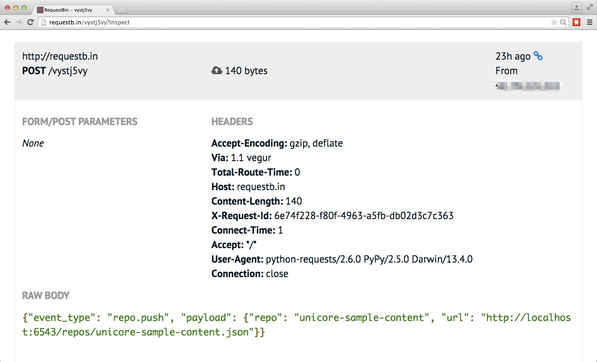
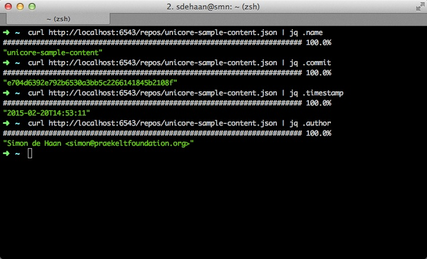
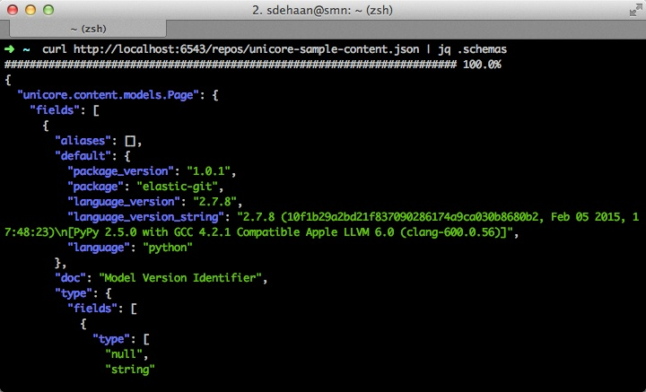
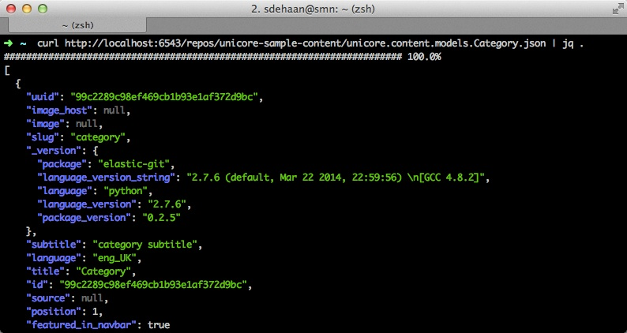
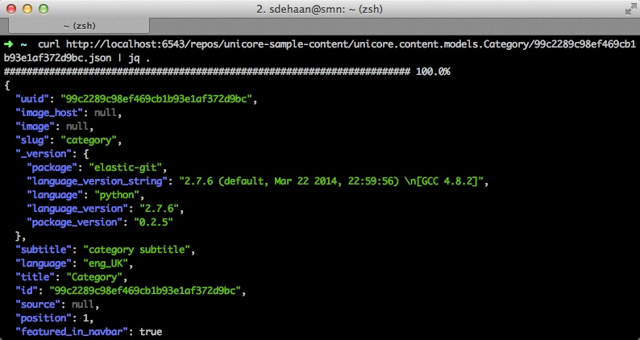

.. unicore.distribute documentation master file, created by
   sphinx-quickstart on Fri Feb 13 17:39:38 2015.
   You can adapt this file completely to your liking, but it should at least
   contain the root `toctree` directive.

Welcome to unicore.distribute's documentation!
==============================================

unicore.distribute is a collection of APIs and tools for dealing with
Universal Core content repositories.

.. image:: https://travis-ci.org/universalcore/unicore.distribute.svg?branch=develop
    :target: https://travis-ci.org/universalcore/unicore.distribute
    :alt: Continuous Integration

.. image:: https://coveralls.io/repos/universalcore/unicore.distribute/badge.png?branch=develop
    :target: https://coveralls.io/r/universalcore/unicore.distribute?branch=develop
    :alt: Code Coverage

.. image:: https://readthedocs.org/projects/unicoredistribute/badge/?version=latest
    :target: https://unicoredistribute.readthedocs.org
    :alt: unicore.distribute Documentation

.. image:: https://pypip.in/version/unicore.distribute/badge.svg
    :target: https://pypi.python.org/pypi/unicore.distribute
    :alt: Pypi Package

Installation
============

The recommended way to install this for development is to install
it in a virtualenv_ but it's not necessary.

.. code-block:: bash

    pip install unicore.distribute

Configuration
=============

Put the following in a file called ``development.ini``

::

    [app:main]
    use = egg:unicore.distribute
    repo.storage_path = repos/

    [server:main]
    use = egg:waitress#main
    host = 0.0.0.0
    port = 6543

Running
=======

Clone a Universal Core content repository and run the server::

    $ git https://github.com/smn/unicore-sample-content \
        repos/unicore-sample-content
    $ pserve development.ini
    $ curl http://localhost:6543/repos.json

It is also possible the clone a repository directly from the API::

    $ curl -XPOST -H 'Content-Type: application/json' \
        -d '{"repo_url": "https://example.com/repo.git"}' \
        http://localhost:6543/repos.json

Webhooks
========

The application can notify you when it is notified of changes made to
the upstream repository::

Make sure the lines in ``development.ini`` relating to ``unicore.webhooks``
are uncommented and then initialize the database::

    $ alembic upgread head

Now your database is configured and you can store Webhooks::

    $ curl -XPOST \
        -H 'Content-Type: application/json' \
        -d '{"event_type": "repo.push", "url": "http://requestb.in/vystj5vy", "active": true}' \
        http://localhost:6543/hooks
    {
        "uuid": "09b901ccc5094f1a89f8bd03165fe3d6",
        "owner": null,
        "url": "http://requestb.in/vystj5vy",
        "event_type": "repo.push",
        "active": true
    }

.. note:: Currently the only ``event_type`` supported is ``repo.push``

Now if we notify the API of changes being made upstream (say via GitHub's webhooks)
we will now relay that all webhooks registered::

    $ curl -XPOST http://localhost:6543/repos/unicore-sample-content.json

Here is the request made to the registered URL with the JSON payload:

Polling
=======

Unicore.distribute ships with a command line program::

    $ unicore.distribute --help
    usage: unicore.distribute [-h] {poll-repositories} ...

    unicore.distribute command line tools.

    positional arguments:
      {poll-repositories}  Commands
        poll-repositories  poll repositories

    optional arguments:
      -h, --help           show this help message and exit

The only feature currently available is one which can be used to poll
repositories at a regular interval to see if new content has arrived.
If that is the case then an event is fired and the registered webhook URLs
are called::

    $ unicore.distribute poll-repositories --help
    usage: unicore.distribute poll-repositories [-h] [-d REPO_DIR] [-i INI_FILE]
                                            [-u BASE_URL]

    optional arguments:
        -h, --help            show this help message and exit
        -d REPO_DIR, --repo-dir REPO_DIR
                              The directory with repositories.
        -i INI_FILE, --ini-file INI_FILE
                              The project's ini file.
        -u BASE_URL, --base-url BASE_URL
                              This server's public URL (for webhooks)

Hook up the ``poll-repositories`` sub-command to cron for regular polling::

    */15 * * * * unicore.distribute poll-repositories -d /var/praekelt/repos/ -i development.ini -u http://unicore.io

Querying
========

The individual repositories are all exposed via the ``repos.json`` base path.
Let's step through the process of cloning a repository and then querying
the data via the web interface::

    $ curl -XPOST -H 'Content-Type: application/json' \
        -d '{"repo_url": "https://github.com/smn/unicore-sample-content.git"}' \
        http://localhost:6543/repos.json

Now ``repos/unicore-sample-content.json`` accessible via the API and exposes
the schema and some metadata about the content.

The ``schema`` key in the repository object has an Avro_ schema representing
the content. This allows one to automatically generate model definitions to
work with the data.

Now that we have a list of all object types in the content repository we can
get listings of these models:

Or we can get an individual object by requesting it by its UUID:

URL structure
=============

The following URLs are created::

    http://localhost:6543/repos.json [GET, POST]
    http://localhost:6543/repos/<repo-name>.json [GET]
    http://localhost:6543/repos/<repo-name>/<content-type>.json [GET]
    http://localhost:6543/repos/<repo-name>/<content-type>/<uuid>.json [GET, PUT, DELETE]

.. note::

    The PUT and DELETE methods only operate on the local repository, the
    are not pushed up to the upstream repository that was cloned.

.. _virtualenv: https://virtualenv.pypa.io/en/latest/
.. _Avro: avro.apache.org/docs/1.7.7/spec.html
